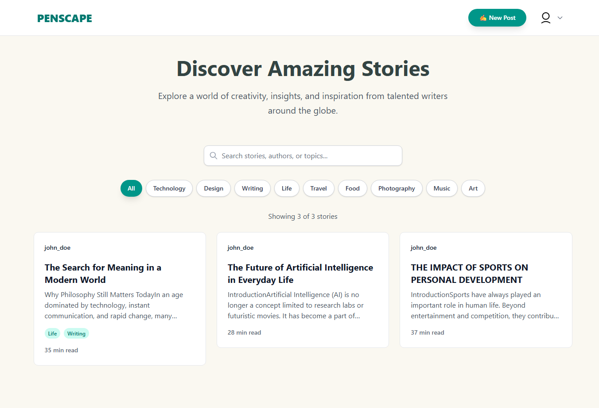

# Penscape

A simple full-stack writing platform where users can sign up, sign in, and publish blogs.

- Live app: [https://penscape.curr.xyz](https://penscape.curr.xyz)

## Preview



## Features

- User authentication (signup/signin with JWT)
- Create, edit, and publish blog posts
- View public blogs and user profile details
- Responsive UI with smooth writing-focused experience with tip tap

## Tech Stack

- Frontend: React, TypeScript, Vite, Tailwind CSS, Framer Motion
- Backend: Hono on Cloudflare Workers
- Database: Postgres , Prisma ORM
- Validation/Auth: Zod, JWT

## Clone and Run Locally

```bash
git clone <your-repo-url>
cd penscape
```

### 1) Start backend

```bash
cd backend
npm install
npm run dev
```

### 2) Start frontend

```bash
cd ../frontend
npm install
npm run dev
```


